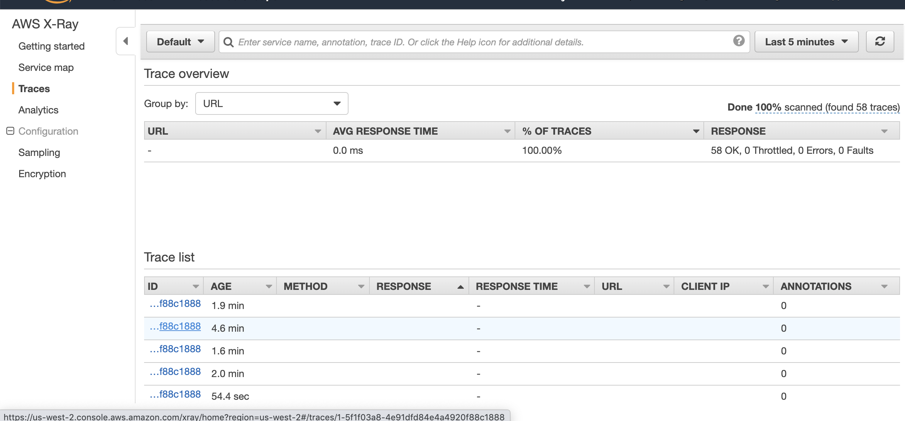

### Run ADOTCollector Beta Examples with Docker

This example will introduce how to run ADOTCollector Beta in the Docker container. This example uses a AWS data emitter container image that will generate Open Telemetry Protocol (OTLP) format based metrics and traces data to AWS CloudWatch and X-Ray consoles.  

Please follow the steps below to try ADOT Collector Beta.

#### Prerequisite

If you haven't setup your AWS Credential profile yet, please follow the [instruction](https://docs.aws.amazon.com/cli/latest/userguide/cli-configure-quickstart.html) for setting up your AWS credentials.

#### Run a single ADOT Collector instance in Docker

* Checkout `aws-otel-collector` source code to get the example configuration in the `examples` folder.

```bash
    git clone https://github.com/aws-observability/aws-otel-collector.git
    cd aws-otel-collector
```

* [Optional] To configure `healthcheck` for `aws-otel-collector`, [run](https://github.com/aws-observability/aws-otel-collector/blob/main/docs/developers/docker-demo.md) the `aws-otel-collector` instance in Docker with these additional arguments:
```bash
    --health-cmd='/healthcheck' \
    --health-interval=5s 
```

* Start the `aws-otel-collector` instance in Docker using the `default` AWS Credential profile.

```bash
    docker run --rm -p 4317:4317 -p 55680:55680 -p 8889:8888 \
      -e AWS_REGION=us-west-2 \
      -e AWS_PROFILE=default \
      -v ~/.aws:/home/aoc/.aws \
      -v "${PWD}/examples/docker/config-test.yaml":/otel-local-config.yaml \
      --name awscollector public.ecr.aws/aws-observability/aws-otel-collector:latest \
      --config otel-local-config.yaml;
```

* or by setting the `AWS_ACCESS_KEY_ID`, `AWS_SECRET_ACCESS_KEY` environment variables.

```bash
    docker run --rm -p 4317:4317 -p 55680:55680 -p 8889:8888 \
      -e "AWS_ACCESS_KEY_ID=${AWS_ACCESS_KEY_ID}" \
      -e "AWS_SECRET_ACCESS_KEY=${AWS_SECRET_ACCESS_KEY}" \
      -e AWS_REGION=us-west-2 \
      -v "${PWD}/examples/docker/config-test.yaml":/otel-local-config.yaml \
      --name awscollector public.ecr.aws/aws-observability/aws-otel-collector:latest \
      --config otel-local-config.yaml;
```

*Note:* The example configuration assumes `us-west-2` for the region, modify as necessary.

#### Run ADOT Collector with Sample App in Docker Compose

1. Checkout `aws-otel-collector` source code, and open the ```docker-compose.yaml``` under ```examples``` folder.
Please make sure you have the right aws credential path (eg, `~/.aws:/home/aoc/.aws`) and the collector config file (eg, `../config.yaml:/etc/otel-agent-config.yaml`) set.
 You can also directly use your AWS credential key by setting up these environment variables ```AWS_ACCESS_KEY_ID```, ```AWS_SECRET_ACCESS_KEY``` and ```AWS_REGION``` in the config.
  The region is where the data will be sent to.
```# Agent aws-otel-collector:
    image: public.ecr.aws/aws-observability/aws-otel-collector:latest
    command: ["--config=/etc/otel-agent-config.yaml"]
    environment:
      - AWS_ACCESS_KEY_ID=<to_be_added>
      - AWS_SECRET_ACCESS_KEY=<to_be_added>
      - AWS_REGION=<to_be_added>
    volumes:
      - ../config.yaml:/etc/otel-agent-config.yaml // use default config
      - ~/.aws:/home/aoc/.aws
```
2. Once you have the ```docker-compose.yaml``` file setup and saved, run the following make command.
```
cd examples; docker-compose -f ./docker/docker-compose.yaml up 
```
3. Now you can view you data in AWS console

    * X-Ray - aws console
    * CloudWatch - aws console  
    
**AWS Metrics Sample Data**   
*   
**AWS Traces Sample Data**
*   

4. Stop the running ADOTCollector in Docker container
```
make docker-stop
```
